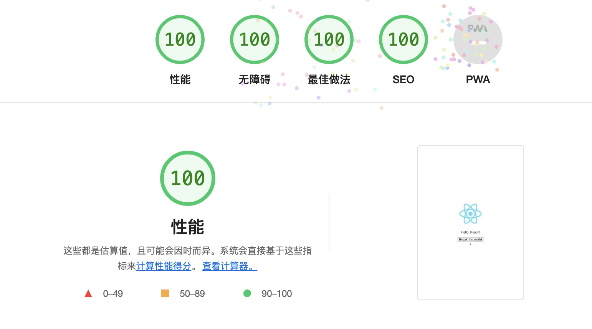

# react-ts-webpack5-boilerplate

[English Doc](./README.md) · [中文文档](./README.zh-CN.md)

Use react17, webpack5, axios, typescript to build templates, high performance, good compatibility, priority support for mobile terminals

## Technology stack

- react family
- typescript
- webpack5
- swc / swc-loader
- esbuild / esbuild-loader
- css modules
- less
- postcss

## Performance score

## Technical solutions

|      | compile | compress           | prebuild + single dev       |
| ---- | ------- | ------------------ | --------------------------- |
| dev  | swc     |                    | esbuild + Module Federation |
| prod | swc     | esbuild（css、js） |                             |

## TODO

- [ ] prebuild + single dev
- [ ] pwa
