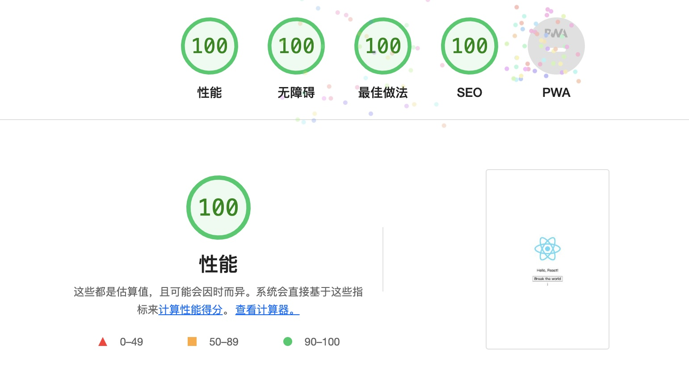

# react-ts-webpack5-boilerplate

使用 react17、webpack5、axios、typescript 构建模板，高性能、兼容性好、优先支持移动端

## 技术栈

- react family
- typescript
- webpack5
- swc / swc-loader
- esbuild / esbuild-loader
- css modules
- less
- postcss

## 性能评分

## 技术方案

|      | compile | compress           | prebuild + single dev       |
| ---- | ------- | ------------------ | --------------------------- |
| dev  | swc     |                    | esbuild + Module Federation |
| prod | swc     | esbuild（css、js） |                             |

## TODO

- [ ] prebuild + single dev
- [ ] pwa
